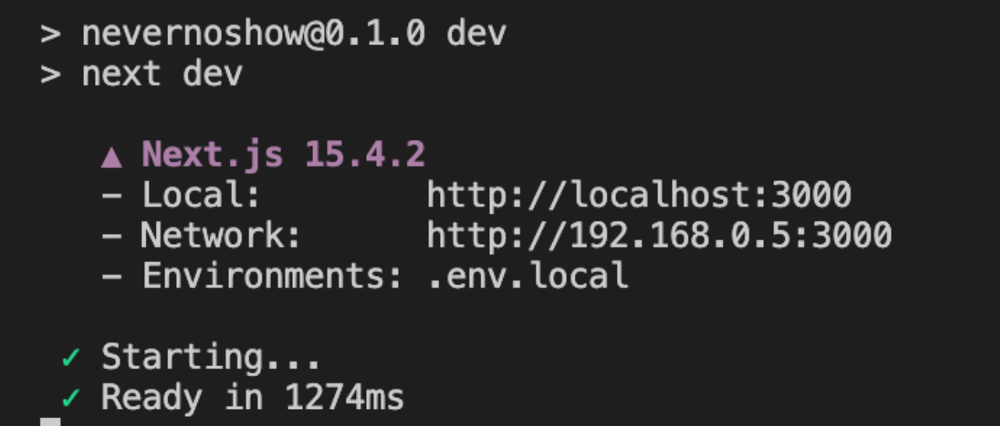

# How to run app
## Prerequisites

- [Node.js](https://nodejs.org/) (v18 or later recommended)
- [npm](https://www.npmjs.com/)
- (Optional) Configure environment variables in a `.env.local` file

## 1. Install Dependencies

```bash
npm install
```

## 2. Start the Development Server

**Option A: Use Local API (Development)**
```bash
# Terminal 1 - Start Azure Functions locally
cd api && func start

# Terminal 2 - Start Frontend  
npm run dev
```

**Option B: Use Production API (If Deployed)**
```bash
npm run dev
```

The app will be running at [http://localhost:3000](http://localhost:3000).

you will see something like this in terminal



## 3. (Optional) Build for Production

```bash
npm run build
npm start
```

## 4. (Optional) Run Tests

```bash
npm test
```

# Major links 

- [Project Repository](https://github.com/your-org/your-repo)  
- [Live App](http://localhost:3000) (after running locally)
- [Azure Portal](https://portal.azure.com/)
- [db query editor]()


# Usual troubleshooting things

Clean Next.js build cache to resolve compilation errors

rm -rf .next


Kill all running Next.js, Azure Functions, and Node.js processes
pkill -f "next" && pkill -f "func" && pkill -f "node"


# How to View the Database

### Option 1: VS Code Extension (Recommended)
1. **Install**: "SQL Server (mssql)" extension in VS Code
2. **Connect** using connection string
3. **Browse and query** directly in VS Code

USER: mn: Jul 26 2025: this is what i am doing rt now

### Option 2: Azure Portal Query Editor
1. Go to Azure Portal → Your SQL Database
2. Click "Query editor (preview)" 
3. Login and run SQL queries directly in browser


## 🔍 Quick Queries to Test Changes

```sql
-- See all landlords
SELECT * FROM Landlords;

-- See all submissions with details
SELECT 
    s.id,
    s.tenantEmail,
    s.score,
    s.submittedAt,
    l.name as landlordName
FROM Submissions s
JOIN Landlords l ON s.landlordId = l.id
ORDER BY s.submittedAt DESC;

-- Count records
SELECT 
    (SELECT COUNT(*) FROM Landlords) as Landlords,
    (SELECT COUNT(*) FROM Submissions) as Submissions,
    (SELECT COUNT(*) FROM Tenants) as Tenants;
```

**Other Options Available:** SSMS, Azure Data Studio, Command Line (sqlcmd) - but we're focusing on the options above for simplicity.
1. Go to Azure Portal → Your SQL Database
2. Click "Query editor (preview)" 
3. Login and run SQL queries directly in browser